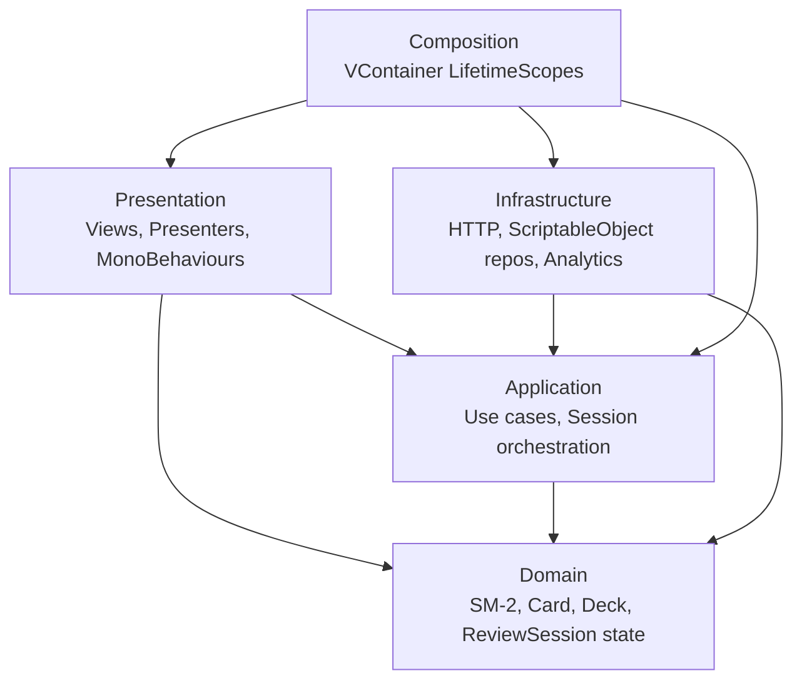

# Memory Foyer

A spaced-repetition trainer (SM-2) with a minimal 3D foyer for deck selection. A Unity 6 portfolio project demonstrating strict layered architecture (Domain / Application / Infrastructure / Presentation / Composition) with VContainer.

> **Status:** v1.0 — feature-complete for the portfolio scope. See [docs/Roadmap.md](docs/Roadmap.md) for phase history.

## Why this project

The flashcard domain here is deliberately small. It is a controlled vehicle to demonstrate two things: (1) a strict layered architecture where the SM-2 algorithm and session orchestration compile and unit-test as pure C# behind compile-enforced assembly boundaries, and (2) a real client–server contract backed by an authoritative server. The Node + SQLite backend exists to fill the backend gap a Unity-only portfolio leaves open — server-side scheduling, idempotent session submission, and an explicit API contract.

## Demo


One full cycle: pick a deck in the foyer → grade cards in review → session summary.

## Highlights

- **Strict layered architecture** — five assembly-enforced layers. `Domain` and `Application` are compiled with `noEngineReferences: true`, so the SM-2 algorithm and session orchestration build and unit-test without `UnityEngine`. See [docs/architecture.md](docs/architecture.md).
- **Server-authoritative SM-2** — the algorithm is duplicated as pure C# (`Assets/Scripts/Domain/Scheduling/Sm2Algorithm.cs`) and server JS (`server/sm2.js`), each with its own test suite. The server result is the source of truth and overwrites the client cache after every submission. See [docs/GDD.md](docs/GDD.md) §4.
- **Tested across every layer** — 12 EditMode suites covering Domain, Application, Infrastructure, and Editor, plus a backend SM-2 suite and an HTTP integration suite.
- **Idempotent authoritative backend** — Express + SQLite, five endpoints, `zod` request validation, and submission de-duplication keyed on `sessionId` + `payload_hash`. See [server/README.md](server/README.md).
- **Offline-degraded fallback** — `CachingScheduleStore` runs HTTP as primary with an atomic JSON cache fallback. On reconnect it drains queued sessions FIFO, then overwrites the cache from the server. See [docs/architecture.md](docs/architecture.md).
- **UI Toolkit Deck Author** — an in-editor authoring window (`Tools → Memory Foyer → Deck Author`) with an atomic Export to `server/decks.json`, keeping deck content a single diffable source of truth.

## Tech stack

- Unity 6000.4.1f1 (URP, Linear color space)
- VContainer — DI
- UniTask — async
- MessagePipe — in-process pub/sub (integrated with VContainer)
- DOTween — tweening
- Cinemachine — camera
- Unity Test Framework (NUnit) — EditMode tests
- Node.js + Express + SQLite — local authoritative backend

## Run

### Unity client

1. Install Unity `6000.4.1f1` via Unity Hub.
2. Open this folder as a project; URP will import on first launch.
3. Open `Assets/Scenes/Foyer.unity` and press Play.

### Backend

```bash
cd server
npm install
npm start
# http://localhost:3000/health
```

See [server/README.md](server/README.md).

### Tests

```bash
cd server
npm test          # backend: SM-2 + HTTP integration suites
```

Unity EditMode tests run from **Window ▸ General ▸ Test Runner** (EditMode tab), or headless:

```bash
<Unity> -runTests -projectPath . -testPlatform EditMode -batchmode -logFile -
```

## Architecture

`Domain` is compiled without `UnityEngine`, and time flows through an `IClock` interface, so the SM-2 algorithm is unit-testable in pure C#. Dependencies point inward and are enforced by `.asmdef` references.



Full reference (contracts, DI lifetimes, `CachingScheduleStore` algorithm): [docs/architecture.md](docs/architecture.md).

## Documentation

- [docs/GDD.md](docs/GDD.md) — game design, mechanics, SM-2 rules
- [docs/architecture.md](docs/architecture.md) — layers, dependency rules, asmdefs
- [server/README.md](server/README.md) — backend API, schema, idempotency contract
- [docs/Roadmap.md](docs/Roadmap.md) — project phases and next steps

## Trade-offs and what's next

Deliberate trade-offs, each made to keep the portfolio scope honest:

- **Local-only authoritative server; multi-device is last-write-wins.** Single-device by design — cloud hosting and auth are intentionally out of scope.
- **Offline is degraded, not full.** A populated cache lets a session start and queue uploads, but a long offline stretch lets cached `dueAt` values drift. Acceptable for a single-user tool.
- **A mid-session hard crash before flush can drop the in-flight session.** A normal app close survives via the on-disk pending queue; a write-ahead log is the production answer and is out of scope here.
- **Layered, not Clean/Onion verbatim.** Deliberately the minimum split that makes SM-2 testable in pure C# — no separate Use-Cases assembly, no DTOs in Application.
- **English-only, no retention mechanics.** No notifications, streaks, or goals — it is a tool, not a service.

The full honest list lives in [docs/GDD.md](docs/GDD.md) §15.

**What's next:** v1.0 is feature-complete for the portfolio scope — foyer → review → summary against the authoritative backend, with tests across every layer. Remaining phases are tracked in [docs/Roadmap.md](docs/Roadmap.md).

## License

[MIT](LICENSE).
