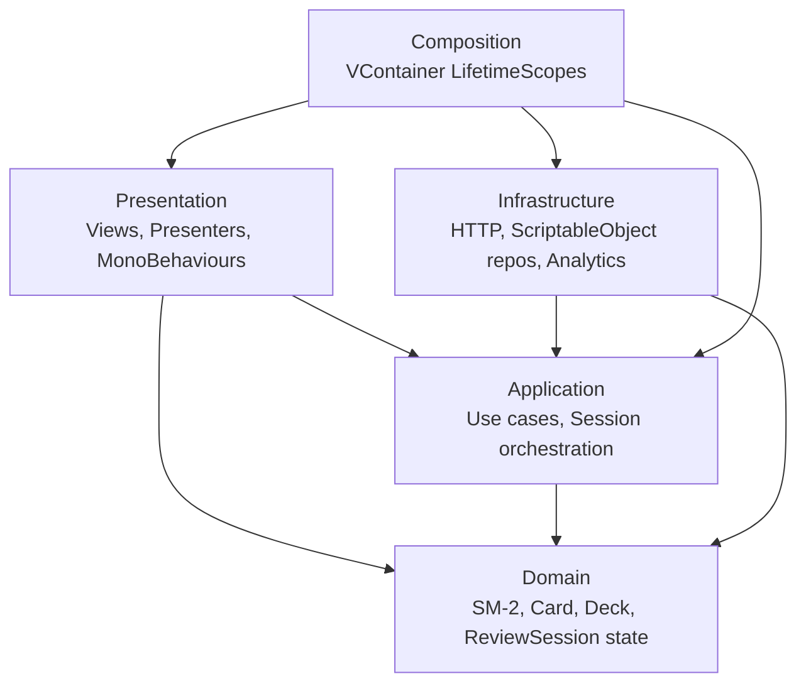

# Architecture

Memory Foyer uses a **layered architecture** with strict separation enforced by Unity assembly definitions. The whole point is that the SM-2 spaced-repetition algorithm and session orchestration compile and run **without UnityEngine** — meaning they're trivially unit-testable and could in principle move to a server, a CLI, or another engine without rewriting the core.

## Layers

## Dependency rules (enforced by .asmdef references)

- **Domain** — depends on **nothing**, including no UnityEngine. Pure C#. Any class under `Assets/Scripts/Domain/` must compile outside Unity. `noEngineReferences: true` in the .asmdef enforces this — adding `using UnityEngine;` will fail compilation.
- **Application** — depends only on **Domain**. UnityEngine is forbidden. Async signatures use `UniTask` (the package is plain-C#-friendly even though it ships in a Unity context). This layer holds use-case orchestration and the interfaces that Infrastructure implements.
- **Infrastructure** — depends on **Application** and **Domain**. May use `UnityEngine` (e.g. `UnityWebRequest`, `ScriptableObject`). Implements the interfaces declared in Application.
- **Presentation** — depends on **Application** and **Domain**. Uses UnityEngine, UI packages, Cinemachine, DOTween. **Does not depend on Infrastructure** — Presentation talks to Application interfaces, never to concrete implementations.
- **Composition** — the only layer that sees everything. `LifetimeScope` classes wire concrete Infrastructure implementations to Application interfaces and inject them into Presentation entry points.

## Assembly definitions

| asmdef | References | Engine refs |
|---|---|---|
| `MemoryFoyer.Domain` | (none) | `noEngineReferences: true` |
| `MemoryFoyer.Application` | `MemoryFoyer.Domain`, `Cysharp.Threading.Tasks`, `MessagePipe` | `noEngineReferences: true` |
| `MemoryFoyer.Infrastructure` | `MemoryFoyer.Application`, `MemoryFoyer.Domain`, `Cysharp.Threading.Tasks`, `MessagePipe` | yes |
| `MemoryFoyer.Presentation` | `MemoryFoyer.Application`, `MemoryFoyer.Domain`, `Cysharp.Threading.Tasks`, `MessagePipe`, `Unity.TextMeshPro`, `Unity.Cinemachine`, `DOTween`, `VContainer`, `MessagePipe.VContainer` | yes |
| `MemoryFoyer.Composition` | all of the above + `VContainer`, `MessagePipe.VContainer` | yes |
| `MemoryFoyer.Editor` | all application layers + `UnityEditor` | yes; `includePlatforms: ["Editor"]` |
| `MemoryFoyer.Tests.EditMode` | all layers + test-runner refs | yes; `includePlatforms: ["Editor"]`; `optionalUnityReferences: ["TestAssemblies"]` |

## Composition root

VContainer with two scopes:

- **`ProjectLifetimeScope`** — long-lived, holds the SM-2 algorithm singleton, `IClock`, `ServerConfig`, `IDeckRepository`, `IHttpClient`, the `IScheduleStore` triple (`HttpScheduleStore` primary + `JsonFileScheduleCache` fallback wired through `CachingScheduleStore`), `IAnalyticsService`, `IReviewSessionService`. Lives in a persistent scene loaded via `DontDestroyOnLoad` (or via `parentReference` from the per-scene scope).
- **`FoyerLifetimeScope`** — per-scene, registers `FoyerPresenter` and `ReviewPresenter` as `IAsyncStartable` entry points, plus the `PedestalView[]` and `ReviewView` MonoBehaviour references collected via `RegisterComponentInHierarchy<T>()` (or assigned through SerializeField on the scope itself).

MessagePipe is registered first in `ProjectLifetimeScope.Configure(...)` and brokers `SessionStartedEvent`, `CardReviewedEvent`, `SessionFinishedEvent`, `DeckSelectedEvent`. UI presenters subscribe via `ISubscriber<T>` and the session service publishes via `IPublisher<T>` — both injected by the container.

## Project-specific conventions

- **Time through an interface.** `IClock.UtcNow` instead of `DateTime.UtcNow`. SM-2 is time-sensitive — a flaky `DateTime.UtcNow` in tests was the very reason this rule exists. Randomness is not introduced as an interface yet because the algorithm and session ordering are deterministic; add `IRandomProvider` only when a non-deterministic feature requires it.
- **Models are immutable records.** `Card`, `Deck`, `Sm2State` are `record` (or `readonly record struct` for IDs). Repositories hold mutable references; updates use `with`-expressions.
- **DTOs live in Infrastructure.** Mapping between Domain types and DTOs (`Sm2StateDto`, `CardScheduleDto`, `DeckScheduleDto`, `SessionResultDto`, `CardReviewDto`) happens in `Infrastructure/Dtos/ScheduleMappers.cs`. Domain doesn't know about JSON or HTTP.
- **Server is authoritative for `Sm2State`.** Per-card schedules live in the SQLite database behind the API. Client uses `IScheduleStore` (Application interface); `HttpScheduleStore` is the primary implementation, `JsonFileScheduleCache` provides degraded offline read-back, and `CachingScheduleStore` orchestrates the two. URL and timeouts come from a `ServerConfig` record built from a `ServerConfigAsset` ScriptableObject — never hardcoded.
- **Composition guards reentrancy.** `IReviewSessionService.StartAsync` throws `InvalidOperationException` if state is not `Idle` — protects against double-clicks on a pedestal.
- **Strict nullable is per asmdef.** Each asmdef we own ships with a co-located `csc.rsp` enabling `-nullable:enable -warnaserror+:nullable`. The project-level `Assets/csc.rsp` is intentionally empty (Unity passes every line of it as a compiler argument and has no comment syntax — keep it zero bytes) so `Assembly-CSharp-firstpass` (third-party code under `Assets/Plugins/`) compiles with defaults. Adding a new asmdef without its `csc.rsp` means losing the third architectural enforcement (alongside layer separation and the `IClock` indirection).

## What this architecture is *not*

- It's **not** Clean Architecture / Onion / Hexagonal verbatim. It borrows the layer names and dependency direction but stays pragmatic for a small Unity project — no separate "Use Cases" assembly, no DTOs in Application, no IoC container abstraction.
- It's **not** over-engineered for a multi-million LOC enterprise system. It's deliberately the minimum split that makes the SM-2 algorithm testable in pure C# while keeping the Unity-side presenters thin.
