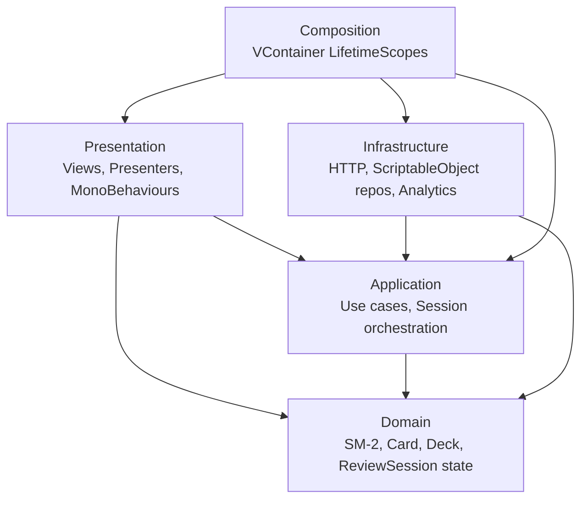

# Architecture

Memory Foyer uses a **layered architecture** with strict separation enforced by Unity assembly definitions. The whole point is that the SM-2 spaced-repetition algorithm and session orchestration compile and run **without UnityEngine** — meaning they're trivially unit-testable and could in principle move to a server, a CLI, or another engine without rewriting the core.

## Layers



## Dependency rules (enforced by .asmdef references)

- **Domain** — depends on **nothing**, including no UnityEngine. Pure C#. Any class under `Assets/Scripts/Domain/` must compile outside Unity. `noEngineReferences: true` in the .asmdef enforces this — adding `using UnityEngine;` will fail compilation.
- **Application** — depends only on **Domain**. UnityEngine is forbidden. Async signatures use `UniTask` (the package is plain-C#-friendly even though it ships in a Unity context). This layer holds use-case orchestration and the interfaces that Infrastructure implements.
- **Infrastructure** — depends on **Application** and **Domain**. May use `UnityEngine` (e.g. `UnityWebRequest`, `ScriptableObject`). Implements the interfaces declared in Application.
- **Presentation** — depends on **Application** and **Domain**. Uses UnityEngine, UI packages, Cinemachine, DOTween. **Does not depend on Infrastructure** — Presentation talks to Application interfaces, never to concrete implementations.
- **Composition** — the only layer that sees everything. `LifetimeScope` classes wire concrete Infrastructure implementations to Application interfaces and inject them into Presentation entry points.

## Assembly definitions

| asmdef | References | Engine refs |
|---|---|---|
| `MemoryFoyer.Domain` | (none) | `noEngineReferences: true` |
| `MemoryFoyer.Application` | `MemoryFoyer.Domain`, `Cysharp.Threading.Tasks`, `MessagePipe` | `noEngineReferences: true` |
| `MemoryFoyer.Infrastructure` | `MemoryFoyer.Application`, `MemoryFoyer.Domain`, `Cysharp.Threading.Tasks`, `MessagePipe` | yes |
| `MemoryFoyer.Presentation` | `MemoryFoyer.Application`, `MemoryFoyer.Domain`, `Cysharp.Threading.Tasks`, `MessagePipe`, `Unity.TextMeshPro`, `Unity.Cinemachine`, `DOTween`, `VContainer`, `MessagePipe.VContainer` | yes |
| `MemoryFoyer.Composition` | all of the above + `VContainer`, `MessagePipe.VContainer` | yes |
| `MemoryFoyer.Editor` | all application layers + `UnityEditor` | yes; `includePlatforms: ["Editor"]` |
| `MemoryFoyer.Tests.EditMode` | all layers + test-runner refs | yes; `includePlatforms: ["Editor"]`; `optionalUnityReferences: ["TestAssemblies"]` |

## Composition root

VContainer with two scopes:

- **`ProjectLifetimeScope`** — long-lived, holds the SM-2 algorithm singleton, `IClock`, `ServerConfig`, `IDeckRepository`, `IHttpClient`, the `IScheduleStore` triple (`HttpScheduleStore` primary + `JsonFileScheduleCache` fallback wired through `CachingScheduleStore`), `IAnalyticsService`, `IReviewSessionService`. Lives in a persistent scene loaded via `DontDestroyOnLoad` (or via `parentReference` from the per-scene scope).
- **`FoyerLifetimeScope`** — per-scene, registers `FoyerPresenter` and `ReviewPresenter` as `IAsyncStartable` entry points, plus the `FoyerScreen` and `ReviewScreen` aggregator MonoBehaviours (and the persistent `OfflineBannerView` and `InputSystemReviewInputSource`) collected via `RegisterComponentInHierarchy<T>()`. Each `*Screen` owns its canvas root and exposes `Show()` / `Hide()` to its presenter.

MessagePipe is registered first in `ProjectLifetimeScope.Configure(...)` and brokers `DeckSelectedEvent`, `SessionStartedEvent`, `CardReviewedEvent`, `SessionReviewedEvent`, `SessionUploadCompletedEvent`, `BackToFoyerRequested`. Presenters and `SessionTelemetryListener` subscribe via `ISubscriber<T>`; the session service and presenters publish via `IPublisher<T>` — both injected by the container.

## Project-specific conventions

- **Time through an interface.** `IClock.UtcNow` instead of `DateTime.UtcNow`. SM-2 is time-sensitive — a flaky `DateTime.UtcNow` in tests was the very reason this rule exists. Randomness is not introduced as an interface yet because the algorithm and session ordering are deterministic — including overdue credit (GDD §4.4), which is a pure function of `DueAt`/`reviewedAt`; add `IRandomProvider` only when a non-deterministic feature requires it.
- **Models are immutable records.** `Card`, `Deck`, `Sm2State` are `record` (or `readonly record struct` for IDs). Repositories hold mutable references; updates use `with`-expressions.
- **DTOs live in Infrastructure.** Mapping between Domain/Application types and DTOs (`Sm2StateDto`, `CardScheduleDto`, `DeckScheduleDto`, `DeckSummaryDto`, `DeckSummaryListDto`, `SessionResultDto`, `CardReviewDto`) happens in `Infrastructure/Dtos/ScheduleMappers.cs`. Domain doesn't know about JSON or HTTP. `IHttpClient.GetArrayAsync<T>` handles bare top-level JSON arrays (e.g. `GET /decks`) since `JsonUtility` cannot, via an internal `{"items":…}` wrapper.
- **Server is authoritative for `Sm2State`.** Per-card schedules live in the SQLite database behind the API. Client uses `IScheduleStore` (Application interface): `GetDeckSummariesAsync` reads the side-effect-free `GET /decks` aggregate (foyer deck list — never triggers new-card release), `GetDeckScheduleAsync` reads the mutating `GET /decks/:id/schedule` (only when a deck is opened). `HttpScheduleStore` is the primary implementation, `JsonFileScheduleCache` provides degraded offline read-back (schedules **and** deck summaries), and `CachingScheduleStore` orchestrates the two (same try-inner-then-cached-fallback pattern for summaries as for schedules). The pure `DeckOrdering` (Application) deterministically orders the `DeckSummary` list (due-gate → `deckId`). URL and timeouts come from a `ServerConfig` record built from a `ServerConfigAsset` ScriptableObject — never hardcoded.
- **Composition guards reentrancy.** `IReviewSessionService.StartAsync` throws `InvalidOperationException` if state is not `Idle` — protects against double-clicks on a deck button.
- **Screen aggregators are forwarders, not coordinators.** `FoyerScreen` and `ReviewScreen` group leaf views and proxy operations to them; they do not inject services, hold business state, or sequence multiple leaf awaits. Each `*Async` method on a screen returns a single leaf's `UniTask`. The one documented exception: `Show()` and `Hide()` own the screen's own canvas-visibility, and `Show()` MAY synchronously reset stale leaf visibility (hide grade buttons / summary) so a re-entered session starts from a clean baseline. Anything beyond that — multi-await sequencing, decisions based on application state — belongs in the presenter.
- **Strict nullable is per asmdef.** Each asmdef we own ships with a co-located `csc.rsp` enabling `-nullable:enable -warnaserror+:nullable`. The project-level `Assets/csc.rsp` is intentionally empty (Unity passes every line of it as a compiler argument and has no comment syntax — keep it zero bytes) so `Assembly-CSharp-firstpass` (third-party code under `Assets/Plugins/`) compiles with defaults. Adding a new asmdef without its `csc.rsp` means losing the third architectural enforcement (alongside layer separation and the `IClock` indirection).

## Contracts

Method signatures for the Application interfaces. These are the contracts; implementations in Infrastructure follow them. All async signatures use `UniTask` and accept `CancellationToken ct = default` (omitted below for brevity).

### `IClock` (Domain)

```csharp
DateTime UtcNow { get; }
```

### `IDeckRepository` (Application)

```csharp
UniTask<Deck>          GetDeckAsync(DeckId deckId);     // throws DeckNotFoundException
UniTask<IReadOnlyList<Deck>> GetAllAsync();
```

### `IScheduleStore` (Application)

```csharp
UniTask<IReadOnlyList<DeckSummary>> GetDeckSummariesAsync();   // side-effect-free GET /decks (foyer list)
UniTask<DeckSchedule>  GetDeckScheduleAsync(DeckId deckId);   // primary read; may return stale on offline fallback
UniTask                EnqueuePendingAsync(SessionResult result); // atomic offline write (temp+rename) before network attempt
UniTask<DeckSchedule>  UploadSessionAsync(SessionResult result); // returns the full updated schedule (see GDD §8)
UniTask<bool>          IsServerReachableAsync();             // cheap GET /health, used by offline banner
```

### `IPendingDrain` (Application)

```csharp
UniTask DrainPendingAsync();   // flush queued offline sessions FIFO; called by FoyerPresenter at startup
```

Deliberately separate from `IScheduleStore`: draining the offline queue is a startup/reconnect concern, not part of the read/upload contract. `CachingScheduleStore` implements both; Presentation depends only on these Application interfaces, never the concrete composite.

`DeckSchedule` is `record DeckSchedule(DeckId DeckId, IReadOnlyList<CardSchedule> Cards, DateTime FetchedAt, ScheduleSource Source)`. `ScheduleSource` is `{ Server, Cache }` — presenters use it to drive the offline banner.

`SessionResult` is `record SessionResult(Guid SessionId, DeckId DeckId, IReadOnlyList<CardReview> Reviews)` and `CardReview` is `record CardReview(CardId CardId, ReviewGrade Grade, DateTime ReviewedAt)`.

Errors: `HttpScheduleStore` throws `ScheduleStoreUnavailableException` on transport failure (timeout, connection refused, 5xx). `CachingScheduleStore` catches it for `GetDeckScheduleAsync` (returns cache with `Source=Cache` when available, rethrows when cache is empty) and **does not** catch it for `UploadSessionAsync` (the caller queues the pending session). `400`/`409` from the server bubble up as `ScheduleStoreContractException` — these are bugs, not transient.

### `IReviewSessionService` (Application)

```csharp
SessionState State { get; }                   // Idle | Loading | Playing | Uploading | Error
UniTask              StartAsync(DeckId deckId);   // throws InvalidOperationException if State != Idle
void                 RevealCurrent();             // throws if State != Playing; otherwise no-op today.
                                                  // Reserved hook for future time-to-reveal analytics —
                                                  // front-to-back transition is purely a view concern.
UniTask              GradeAsync(ReviewGrade grade); // requires State == Playing; advances queue, may end session
UniTask              EndAsync();                  // Playing → Uploading → Idle
ReviewCard?          CurrentCard { get; }         // null when not Playing
int                  Remaining { get; }
int                  ReviewsCompleted { get; }    // count of GradeAsync calls in current session (incl. Again)
int                  Total { get; }
```

State transitions:

```
Idle ──StartAsync──▶ Loading ──schedule fetched──▶ Playing
                       │                              │
                       ▼                              ├─GradeAsync (queue not empty)──▶ Playing
                     Error                            ├─GradeAsync (queue empty)──▶ Uploading
                       │                              ├─EndAsync──▶ Uploading
                       └────retry (StartAsync)        ▼
                                                    Idle  (or Error on upload failure;
                                                           pending session cached, retry on reconnect)
```

`Error` is terminal until `StartAsync` is called again. Reentrancy is guarded — calling `StartAsync` while not `Idle` throws.

### `IHttpClient` (Application)

```csharp
UniTask<TResponse> GetAsync<TResponse>(string path);
UniTask<TItem[]>   GetArrayAsync<TItem>(string path);   // bare top-level JSON arrays (e.g. GET /decks)
UniTask<TResponse> PostAsync<TRequest, TResponse>(string path, TRequest body);
```

`UnityWebRequestHttpClient` (Infrastructure) implements this. Defaults from `ServerConfig`: `RequestTimeout = 5s`, `Retries = 1` (retry once on transient I/O failure with 200ms back-off; no retry on 4xx).

### `IAnalyticsService` (Application)

```csharp
void TrackSessionStarted(Guid sessionId, DeckId deckId, int cardCount);
void TrackCardReviewed(Guid sessionId, CardId cardId, ReviewGrade grade, DateTime nextDueAt);
void TrackSessionFinished(Guid sessionId, int reviewedCount, TimeSpan duration);
void TrackOfflineFallback(string operation);   // logs degraded-mode events
```

Two implementations: `ConsoleAnalyticsService` (writes via `UnityEngine.Debug.Log` in development builds) and `NoOpAnalyticsService` (release builds). Analytics is **event-driven**: `SessionTelemetryListener` (Application) subscribes to `SessionStartedEvent` / `CardReviewedEvent` / `SessionUploadCompletedEvent` and forwards to `IAnalyticsService` (`TrackSessionFinished` fires only when `Success`). `ReviewSessionService` does not call `IAnalyticsService` directly. `CachingScheduleStore` still calls `TrackOfflineFallback` directly (degraded-mode path, not an event).

## MessagePipe events

Events live in `Application/Events/`. All are `record` types, immutable, no behavior:

```csharp
record DeckSelectedEvent      (DeckId DeckId);
record SessionStartedEvent         (Guid SessionId, DeckId DeckId, int CardCount, DateTime StartedAt);
record CardReviewedEvent           (Guid SessionId, CardId CardId, ReviewGrade Grade, DateTime NextDueAt);
record SessionReviewedEvent        (Guid SessionId, DeckId DeckId, int ReviewedCount);
record SessionUploadCompletedEvent (Guid SessionId, DeckId DeckId, bool Success, int ReviewedCount, TimeSpan Duration);
record BackToFoyerRequested;
```

Publishers: `ReviewSessionService` publishes `SessionStartedEvent` / `CardReviewedEvent` / `SessionReviewedEvent` / `SessionUploadCompletedEvent`; `FoyerPresenter` publishes `DeckSelectedEvent` on deck button click; `ReviewPresenter` publishes `BackToFoyerRequested` when the user dismisses the summary. Subscribers: `ReviewPresenter` (`DeckSelectedEvent`, `SessionReviewedEvent`), `FoyerPresenter` (`BackToFoyerRequested` to re-show the foyer canvas + refresh), `SessionTelemetryListener` (`SessionStartedEvent`, `CardReviewedEvent`, `SessionUploadCompletedEvent` for telemetry).

## DI lifetimes

Registered in `ProjectLifetimeScope.Configure(...)` unless noted:

| Type | Lifetime | Notes |
|---|---|---|
| `IClock` → `SystemClock` | Singleton | stateless |
| `Sm2Algorithm` | Singleton | pure functions |
| `IDeckRepository` → `ScriptableObjectDeckRepository` | Singleton | reads `DeckAsset` once, caches |
| `IHttpClient` → `UnityWebRequestHttpClient` | Singleton | one long-lived instance |
| `ServerConfig` | Singleton (instance) | built from `ServerConfigAsset` at scope setup |
| `IScheduleStore` → `CachingScheduleStore` | Singleton | composite; takes `IScheduleStore` (HTTP) + `IScheduleCache` (file) in constructor |
| `IPendingDrain` → `CachingScheduleStore` | Singleton | same instance as the `IScheduleStore` alias; offline-queue drain entry point |
| `IScheduleStore` → `HttpScheduleStore` (named/inner) | Singleton | wraps `IHttpClient`, surfaces `ScheduleStoreUnavailableException` / `ScheduleStoreContractException` |
| `IScheduleCache` → `JsonFileScheduleCache` | Singleton | offline schedule read-back + pending-upload queue, atomic temp+rename writes |
| `IAnalyticsService` → `ConsoleAnalyticsService` (dev) / `NoOpAnalyticsService` (release) | Singleton | conditional registration |
| `IReviewSessionService` → `ReviewSessionService` | Singleton | holds session state; reentrancy-guarded |
| `SessionTelemetryListener` | Singleton | event→`IAnalyticsService` bridge; eagerly built via `SessionTelemetryStartable` entry point, disposed on root-scope teardown |
| MessagePipe `IPublisher<T>` / `ISubscriber<T>` | Singleton | per the package's defaults |
| `FoyerPresenter`, `ReviewPresenter` | Scoped (per-scene, in `FoyerLifetimeScope`) | `IAsyncStartable` entry points |
| `FoyerScreen`, `ReviewScreen` | Scoped | `RegisterComponentInHierarchy<T>()`; aggregate leaf views and own their canvas root via `Show()`/`Hide()` |
| `OfflineBannerView`, `ErrorBannerView`, `LoadingView` | Scoped | `RegisterComponentInHierarchy<T>()`; banners live on a persistent canvas |
| `FoyerLayoutConfig`, `ArtPaletteConfig` | Scoped (instance) | loaded via `Resources.Load` at scope setup |
| `IReadOnlyDictionary<DeckId, Sprite>` | Scoped (instance) | deck icon map built from `DeckAsset[]` at scope setup |
| `IReviewInputSource` → `InputSystemReviewInputSource` | Scoped | `RegisterComponentInHierarchy<T>().AsImplementedInterfaces()` |

## CachingScheduleStore — algorithm

```
GetDeckScheduleAsync(deckId):
  try:
    schedule = await http.GetDeckScheduleAsync(deckId)
    cache.Save(schedule)
    return schedule with Source = Server
  catch ScheduleStoreUnavailableException:
    if cache.Has(deckId):
      analytics.TrackOfflineFallback("GetDeckSchedule")
      return cache.Load(deckId) with Source = Cache
    rethrow

UploadSessionAsync(result):
  cache.AppendPending(result)              // atomic write (temp + rename) — already on disk before HTTP
  try:
    schedule = await http.UploadSessionAsync(result)
    cache.RemovePending(result.SessionId)
    cache.Save(schedule)
    return schedule
  catch ScheduleStoreUnavailableException:
    analytics.TrackOfflineFallback("UploadSession")
    rethrow                                 // pending stays on disk; caller (ReviewSessionService) transitions to Error

DrainPendingAsync():                        // called on reconnect / app start
  for each pending in cache.LoadPending() (FIFO):
    try:
      await http.UploadSessionAsync(pending)
      cache.RemovePending(pending.SessionId)
    catch transient: stop, retry next round
    catch ScheduleStoreContractException(409 mismatch): drop pending, log
```

The cache uses temp-file + atomic rename for both `Save` and `AppendPending`. Corrupt JSON on read → log + treat as missing (start with empty cache for that deck).

## New-card budget enforcement

The server enforces the per-deck `NewCardsPerDay` cap inside `GET /decks/:id/schedule` by selecting at most `NewCardsPerDay` `Stage=New` cards per UTC day (see [server/README.md new-card release semantics](../server/README.md) for the `released_on` tracking). The client trusts that filter and does not re-cap. No Application-side budget value object exists today; if "`{N} new today`" UI copy is added later, the cap can be read from `DeckAsset.NewCardsPerDay` directly.

## Data-flow walkthroughs

**Online happy path** (3-card session on `capitals` deck):

1. Player clicks the Capitals deck button → `FoyerPresenter` publishes `DeckSelectedEvent("capitals")` and then hides the foyer canvas via `_foyerScreen.Hide()`.
2. `ReviewPresenter` subscribes; resolves the deck for its display name, calls `_reviewScreen.Show()` (which activates the review canvas), then `IReviewSessionService.StartAsync("capitals")`.
3. `ReviewSessionService` transitions `Idle → Loading`, calls `IScheduleStore.GetDeckScheduleAsync("capitals")`.
4. `CachingScheduleStore` → `HttpScheduleStore` → `GET /decks/capitals/schedule` → 200, schedule cached, returned with `Source=Server`.
5. Service filters `DueAt ≤ now`, sorts, builds queue. Transitions `Loading → Playing`, publishes `SessionStartedEvent`. `ReviewPresenter` calls `_reviewScreen.ShowCardAsync(...)` for the first card.
6. Player grades 3 cards → `GradeAsync(Good)` × 3. Each grade: applies `Sm2Algorithm.Schedule` locally (for `NextDueAt` in the event), appends to in-memory `reviews`, persists via `cache.AppendPending`, publishes `CardReviewedEvent`. Between grades the presenter awaits `_reviewScreen.AdvanceToNextCardAsync(...)`.
7. Queue empty → `Playing → Uploading`. Service calls `IScheduleStore.UploadSessionAsync(result)`.
8. `POST /sessions` → 200 with `updatedSchedule` (released subset, same filter as `GET /:id/schedule`). `CachingScheduleStore` removes pending, overwrites cache.
9. `Uploading → Idle`. Publishes `SessionUploadCompletedEvent(Success: true)`. `ReviewPresenter` calls `_reviewScreen.ShowSummary(reviewedCount)`.
10. Player dismisses the summary → `ReviewPresenter` calls `_reviewScreen.Hide()` and publishes `BackToFoyerRequested`. `FoyerPresenter` re-shows the foyer canvas via `_foyerScreen.Show()` and re-fetches deck stats to refresh the buttons.

**Offline → reconnect** (session completes offline, app reopens later):

1. App starts, server unreachable. `FoyerPresenter` calls `GET /decks` → fails → uses cached deck list, shows offline banner.
2. Player starts session. `GetDeckScheduleAsync` falls back to cache (`Source=Cache`).
3. Session completes. `UploadSessionAsync` throws `ScheduleStoreUnavailableException`; pending session is on disk. Service transitions `Uploading → Error`, publishes `SessionUploadCompletedEvent(Success: false)`.
4. App closed, reopened later; server now reachable.
5. `FoyerPresenter` (`IAsyncStartable`) calls `IPendingDrain.DrainPendingAsync()` once at startup (before refreshing the deck list).
6. Pending session uploaded → `cache.RemovePending` → fresh `GET /decks/:id/schedule` overwrites cache.
7. Foyer shows current counts.

## What this architecture is *not*

- It's **not** Clean Architecture / Onion / Hexagonal verbatim. It borrows the layer names and dependency direction but stays pragmatic for a small Unity project — no separate "Use Cases" assembly, no DTOs in Application, no IoC container abstraction.
- It's **not** over-engineered for a multi-million LOC enterprise system. It's deliberately the minimum split that makes the SM-2 algorithm testable in pure C# while keeping the Unity-side presenters thin.
